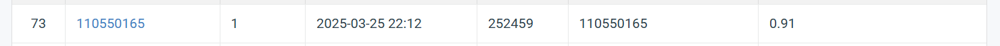

# Selected Topics in Visual Recognition using Deep Learning

## Introduction

This repository contains an image classification model based on ResNeXt50-32x4d with an added Squeeze-and-Excitation (SE) block for improved feature recalibration. 
## Installation

### 1. Clone the Repository
```sh
git clone https://github.com/Roy4016/Homework-1.git
cd Homework-1
```

### 2. Install Dependencies

```sh
pip install -r requirement.txt
```

## Data Preparation

1. Place dataset in the `data/` directory with the following structure:
   ```
   data/
   ├── train/
   │   ├── 0/
   │   ├── 1/
   │   ├── ...
   ├── val/
   │   ├── 0/
   │   ├── 1/
   │   ├── ...
   ├── test/
   │   ├── image_1.jpg
   │   ├── image_2.jpg
   │   ├── ...
   ```

## Training the Model
Run the hw1.py:
```sh
python hw1.py
```

The trained model and prediction will be saved in the `result/` directory as `best_model.pt` and `prediction.csv`.


## Performance Snapshot


